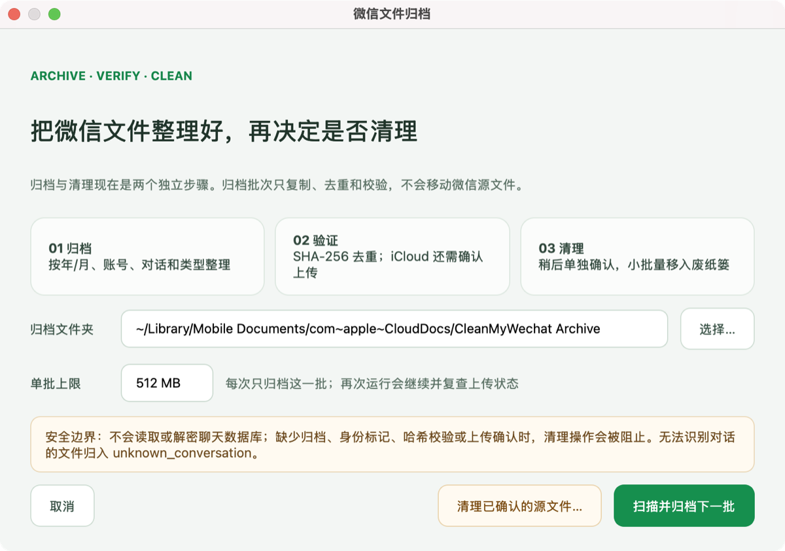

# Clean My WeChat

  

自动删除 PC 端微信自动下载的大量文件、视频、图片等数据内容，解放一年几十 G 的空间占用。

该工具不会删除文字的聊天记录，请放心使用。请给个 **Star** 吧，非常感谢！

**现已经支持 Windows 和 Mac 系统中的所有微信版本，包含最新版的微信 4.0+ 和企业微信。**

Windows 版本：

[国内地址 - 点击下载](
https://wwbie.lanzoue.com/iHgXp3ql84ng)

[Github Release - 点击下载](
https://github.com/blackboxo/CleanMyWechat/releases/download/v2.1/CleanMyWechat.zip)

macOS 版本：

[国内地址 - 点击下载](
https://wwbie.lanzoue.com/iQlBl3v2rk6f)

[Github Release - 点击下载](https://github.com/blackboxo/CleanMyWechat/releases/download/v3.1_mac/CleanMyWechat_v3.1_mac.dmg)

## 特性
1. 自动识别所有微信及企业微信账号；
2. 自由设置想要删除的文件类型，包括文件、图片、视频；
3. 自由设置需要删除的文件的距离时间，默认 365 天；
4. 删除后的文件放置在回收站中，检查后自行清空，防止删错需要的文件；
5. 支持定期自动清理；
6. macOS 支持分批归档：按时间、账号、对话和类型整理并通过 SHA-256 去重；
   归档与源文件清理是两个独立操作，不会在归档过程中自动清理。

## 分批归档与 iCloud 安全清理

主界面的“归档与迁移”会复用当前账号、保留天数、文件类型和白名单设置，
因此只有原本符合清理条件的内容才会进入归档候选。默认归档位置是
`iCloud Drive/CleanMyWechat Archive`，目录结构为
`年/年月/账号/对话/类型/文件名`。微信路径没有提供对话标识时，文件会进入
`unknown_conversation`；本工具不会读取或解密微信消息数据库。

每次只处理一个可配置大小的批次。程序先计算内容哈希，同一内容只保留一个
归档副本；复制通过临时文件完成，并再次校验 SHA-256。对于 iCloud Drive，
程序使用 macOS Foundation 的 ubiquitous-item 状态确认文件已经上传。复制前
还会检查磁盘空间并保留 512 MB 安全余量；源文件清理前也会为本地状态写入
保留 64 MB，避免状态文件或临时副本耗尽系统磁盘。

“扫描并归档下一批”只复制、整理、去重和检查上传，微信源文件始终保持不变。
需要释放空间时，重新打开“归档与迁移”，选择“清理已确认的源文件”。程序会显示
独立确认页，每次最多处理 200 个、512 MB；每个源文件都要再次通过归档身份标记、
归档副本哈希、源文件哈希和上传状态检查，然后才移入系统废纸篓。归档文件夹缺失、
身份标记不匹配、上传中、状态未知、校验失败或源文件变化时都会停止或保留源文件。
非 iCloud 目标没有云端上传阶段，但仍需本地副本校验和独立确认。

再次运行会从本机 SQLite 状态库继续下一批，不会再为每个文件整份重写大型 JSON。
状态库保存在
`~/Library/Application Support/Clean My WeChat/archive_migrations/`，不会放进
iCloud，也不会把本机微信绝对路径写入云端归档。早期试验版的 JSON 清单会保留
原文件并只读导入；旧的“可清理”状态必须重新完成归档验证，不能直接触发清理。

## macOS 启动问题

macOS 构建会应用仓库中的 `entitlements.plist`。如果应用仍无法启动，请检查
`~/Library/Application Support/Clean My WeChat/cleanmywechat_startup_crash.log`
和同目录下的 `cleanmywechat.log`。完全磁盘访问提示中可以打开系统设置，也可以
选择“暂时忽略并继续”；忽略权限不会再直接退出应用。

macOS 主窗口使用原生标题栏，提供系统标准的关闭、最小化和缩放按钮。

## 运行截图

## 微信现状

下载两年时间，微信一个软件就占用多达 33.5 G 存储空间。其中大部分都是与自己无关的各大群聊中的文件、视频、图片等内容，且很久以前的文件仍旧存在电脑中。

## Star History

<a href="https://www.star-history.com/?type=date&repos=blackboxo%2FCleanMyWechat">
 <picture>
   <source media="(prefers-color-scheme: dark)" srcset="https://api.star-history.com/chart?repos=blackboxo/CleanMyWechat&type=date&theme=dark&legend=top-left&sealed_token=DaZSGdkfH0eN1_FMODq8_T4qnX1XWj__nZCfBX0zaijuj90RP2hCrljELrMJer3tzPetSKKjwHR5-70Up7ImF-nTnGstPFYV9EOEKe3fHPyRr1nOU-1MVfoUn-gRTZSFS2TiG-1WPZXLVOJLCiTqmH6HeMpcU38u6V5SLoOwfbprkyYsdXNXi2tDW2--" />
   <source media="(prefers-color-scheme: light)" srcset="https://api.star-history.com/chart?repos=blackboxo/CleanMyWechat&type=date&legend=top-left&sealed_token=DaZSGdkfH0eN1_FMODq8_T4qnX1XWj__nZCfBX0zaijuj90RP2hCrljELrMJer3tzPetSKKjwHR5-70Up7ImF-nTnGstPFYV9EOEKe3fHPyRr1nOU-1MVfoUn-gRTZSFS2TiG-1WPZXLVOJLCiTqmH6HeMpcU38u6V5SLoOwfbprkyYsdXNXi2tDW2--" />
   
 </picture>
</a>

## 关注开发者

欢迎在小红书关注开发者，获取最新动态与更新资讯：

